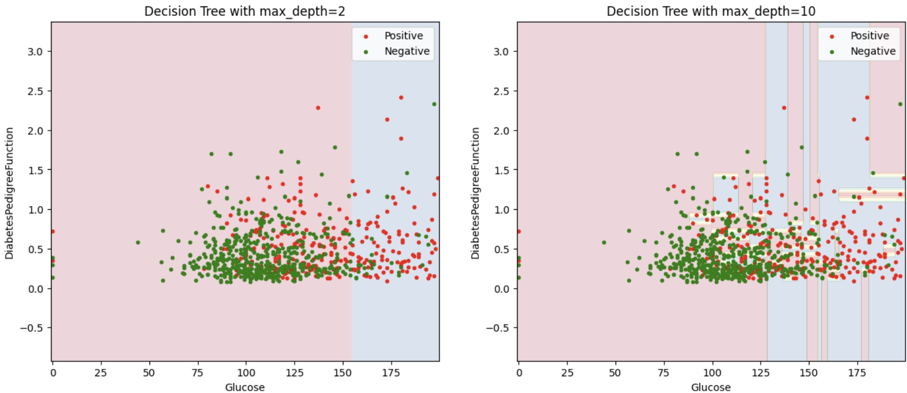

## Projects

### Decision Tree - Machine learning
I trained and compared two decision trees to predict diabetes using the Glucose and DiabetesPedigreeFunction variables:

Shallow tree (max_depth=2): about 76% accuracy on the training data and 69% on the test data.
Deeper tree (max_depth=10): about 93% accuracy on the training data, but only 68% on the test data.
These results illustrate the phenomenon of overfitting: a more complex model (depth 10) can better “memorize” the training data without improving its ability to predict new data. The simpler model (depth 2) generalizes slightly better, even though its training accuracy is more modest.

Source code :  

[back](./)
