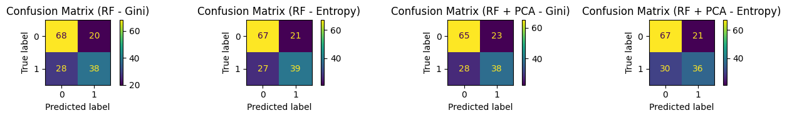
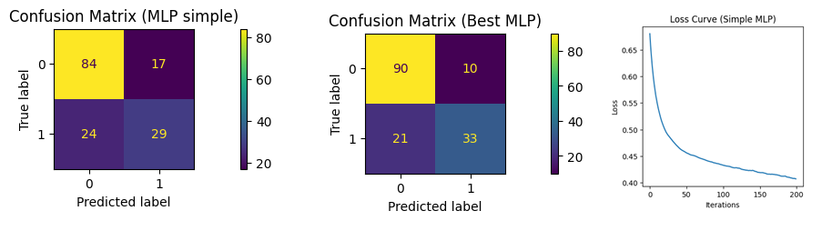

## Projects
### NLP API with FastAPI – 6 Advanced NLP Features
This project aims to deliver a RESTful API built with FastAPI, offering six core features in Natural Language Processing (NLP). Leveraging state-of-the-art models and deep learning architectures, the API provides advanced text processing capabilities such as summarization, text prediction, auto-correction, entity recognition, and question answering. The objective is to create a modular, scalable, and efficient NLP service that can be easily integrated into other applications.

Source code :  

### Comparing Shallow vs. Deep Decision Trees for Diabetes Prediction
In this project, I trained and compared two decision trees using only the Glucose and DiabetesPedigreeFunction variables to predict diabetes. The shallow tree (max_depth=2) achieved about 76% accuracy on the training set and 69% on the test set, while the deeper tree (max_depth=10) reached 93% accuracy on training but only 68% on the test set. This clearly illustrates overfitting: although a more complex model can fit the training data better, it does not necessarily improve predictive power on unseen data. The simpler tree generalized slightly better despite its lower training accuracy.

Source code :  

### Comparative Analysis of Gini Impurity vs. Entropy in a Random Forest Classifier, With and Without PCA

This project focuses on building a Random Forest classifier using two different impurity measures—Gini and Entropy—and comparing their performance on the same dataset. Additionally, it examines how applying Principal Component Analysis (PCA) as a dimensionality-reduction technique affects classification results. By measuring and comparing key metrics, under both criteria and with or without PCA, the project highlights the trade-offs between different impurity measures and the impact of dimensionality reduction. This work also includes data preprocessing, exploratory data analysis, and hyperparameter tuning, providing a comprehensive overview of the end-to-end machine learning workflow.

Source code :  

### Diabetes Prediction Using a Multi-Layer Perceptron (MLP) with scikit-learn

In this project, I aimed to predict the likelihood of developing diabetes based on medical records. I employed an artificial neural network (ANN) of type Multi-Layer Perceptron (MLP) from scikit-learn. Following a thorough data exploration and preparation phase—covering cleaning, encoding, and standardization—I implemented a hyperparameter tuning strategy (varying the number of neurons, hidden layers, activation functions, etc.) to identify the optimal configuration. Model performance was assessed using several classification metrics (accuracy, F1-score, confusion matrix), thereby gauging the model’s ability to effectively flag high-risk patients. This project showcases a comprehensive machine learning workflow, spanning exploratory data analysis to final model evaluation, and highlights the practical utility of neural networks in early diabetes detection.

Source code :

[Back](./)
