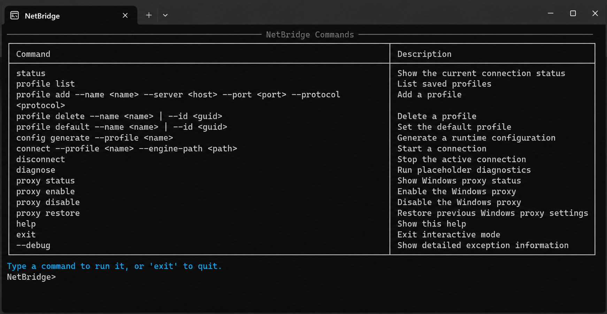
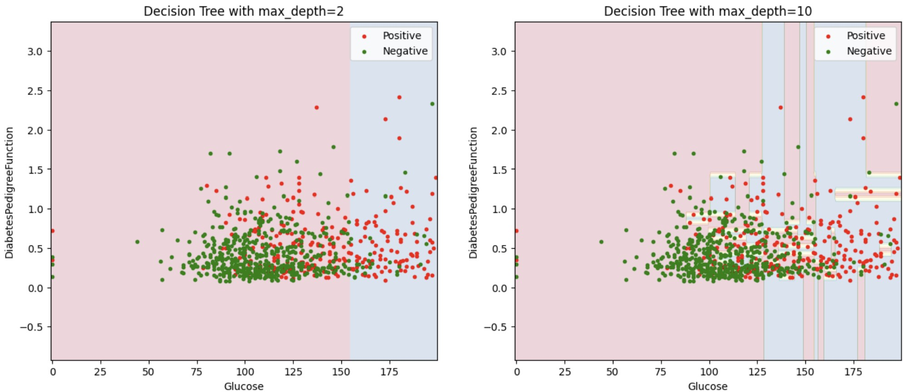
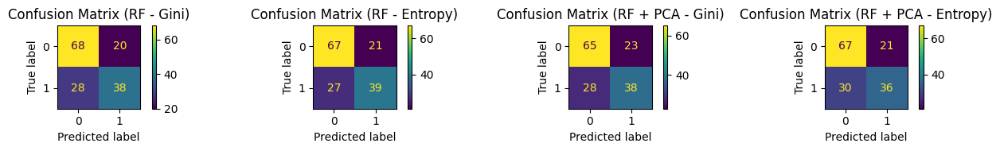
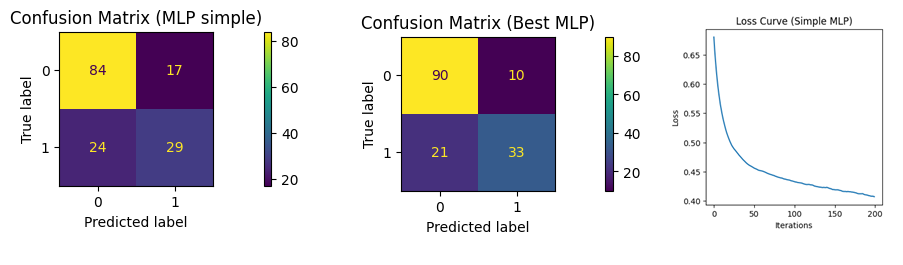

## Projects
### NetBridge - Windows-oriented .NET CLI application for managing local network connectivity workflows
Designed and built a structured CLI tool that coordinates the full local connection lifecycle, including reusable connection profiles, runtime configuration generation, external networking engine execution, live log streaming, Windows proxy operations, and persistent connection state tracking.

Built with Clean Architecture principles to separate CLI presentation, domain contracts, workflow orchestration, infrastructure services, Windows integration, and automated tests.

Key technical focus areas included testable design, safe process lifecycle management, structured command-line UX, Windows Registry and WinINet integration, clear error handling, and maintainable networking-oriented application architecture.

Tech stack: C#, .NET 10, Clean Architecture, Windows Registry, WinINet APIs, Spectre.Console, System.CommandLine, xUnit.

### SmartCVMatcher: AI Resume Matching & Ranking Tool
SmartCVMatcher is an end-to-end AI-powered recruitment tool that eliminates manual CV screening by automatically comparing resumes against job descriptions. Built with Sentence-BERT for deep semantic understanding and XGBoost for candidate scoring, it ranks applicants by relevance with high accuracy. The intuitive Streamlit interface makes it immediately usable by non-technical HR teams, turning hours of manual review into seconds.

Source code :  

### NLP API with FastAPI – 6 Advanced NLP Features
A production-ready RESTful API built with FastAPI, exposing 6 advanced NLP capabilities through a clean, well-documented interface. Features include text summarization, next-word prediction, auto-correction, named entity recognition (NER), and question answering, all powered by state-of-the-art deep learning models. Designed with modularity and scalability in mind, this API can be seamlessly integrated into any application requiring intelligent text processing.

Source code :  

### Comparing Shallow vs. Deep Decision Trees for Diabetes Prediction
A hands-on exploration of overfitting in decision trees, using diabetes prediction as a real-world use case. By training two models, a shallow tree (max_depth=2) and a deep tree (max_depth=10), on the same dataset, this project demonstrates a fundamental ML principle: a more complex model does not always generalize better. The shallow tree achieved 69% test accuracy vs. 68% for the deeper model, despite the latter reaching 93% on training data. A concrete and visual illustration of the bias-variance tradeoff.

Source code :  

### Comparative Analysis of Gini Impurity vs. Entropy in a Random Forest Classifier, With and Without PCA
An in-depth comparative study of two core splitting criteria, Gini Impurity and Entropy, within a Random Forest classifier, enriched by analyzing the effect of PCA-based dimensionality reduction on model performance. Beyond the model comparison, this project covers the full ML pipeline: data preprocessing, exploratory data analysis (EDA), hyperparameter tuning, and performance evaluation using key classification metrics. A practical demonstration of how algorithmic choices and data transformation impact final results.

Source code :  

### Diabetes Prediction Using a Multi-Layer Perceptron (MLP) with scikit-learn
A complete end-to-end machine learning project focused on early diabetes risk detection using a Multi-Layer Perceptron (MLP) neural network.
Starting from raw medical records, the workflow covers data cleaning, encoding, standardization, and hyperparameter tuning, including architecture depth, neuron count, and activation functions.
Model performance is evaluated using accuracy, F1-score, and confusion matrix analysis, with special attention to reducing false negatives, an important consideration in a medical-risk context.
This project demonstrates how neural networks can be applied to structured medical data for predictive modeling and decision-support exploration.

Source code :

[Back](./)
